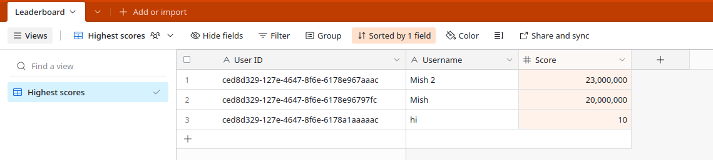
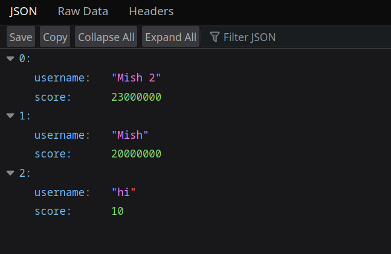

# `cheesecake-worker`

Ahoy! This is the current backend for [Cheesecake Clicker](https://github.com/MMK21Hub/cheesecake-clicker), my clicker game. Check out the main repo for more info.

## API docs

Methods:

- `GET /`: Get the leaderboard data
- `POST /`: Add a new user to the leaderboard, or update your own score/username

## Important deployment documentation

### Cloudflare Workers secrets

```bash
wrangler secret put AIRTABLE_BASE_ID
wrangler secret put AIRTABLE_TABLE_ID
wrangler secret put AIRTABLE_VIEW_ID
wrangler secret put AIRTABLE_API_KEY
```

## Development documentation

Create a `.dev.vars` file in the root of the project, and specify env vars like this:

```env
AIRTABLE_BASE_ID=appABCD
AIRTABLE_TABLE_ID=tblABCD
AIRTABLE_VIEW_ID=viwABCD
AIRTABLE_API_KEY=patABCDEFGHIJKLMNOP
```

Then run the standard `yarn` + `yarn dev` incarnation, and the worker should run locally using Wrangler :)

## Screenshots

Note that in reality, user IDs will be randomly generated UUIDs.





## Deployment documentation

### Deploying to production

Upload and deploy it to Cloudflare Workers using Wrangler:

```bash
wrangler publish
```
